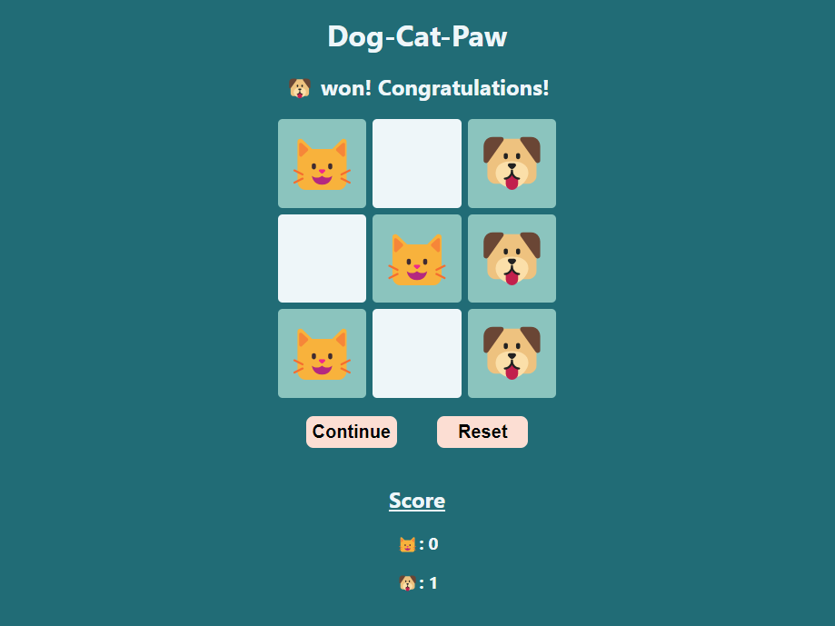

# Dog-Cat-Paw

## Game Overview
Dog-Cat-Paw is a pet-themed version of the popular game, Tic-Tac-Toe, designed for animal lovers. It showcases the fundamentals of HTML, CSS, and JavaScript by providing a fun twist on the classic game with dog and cat icons instead of the traditional Xs and Os.

## Getting Started
Open the link below in your web page, and start playing as your favorite pet. May the best pet win!

To start playing, simply click on the link below:
# [Play Here](https://dogcatpaw.netlify.app/)

## Technologies used

